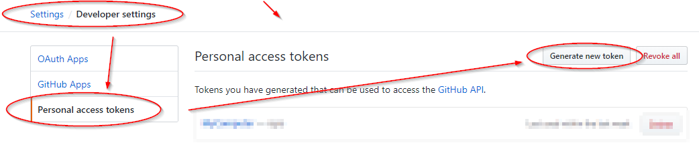

If not already, at a bare minimum, you should be using **2FA (Two-Factor Authentication)** with all services.

Setting up GitHub with 2FA using Google Authenticator is simple and well-documented online. However, setting up 2FA with **Microsoft Visual Studio Code** is not as straightforward.

This post details how I set up my environment to accomplish this.

## Prerequisites

- A **GitHub** account.
- A **Mobile Phone** with Google Authenticator installed. See the link [here](https://support.google.com/accounts/answer/1066447?co=GENIE.Platform%3DAndroid&hl=en) or search for it in the Android/iOS app store.

## Assumptions

- **Microsoft Visual Studio Code** is installed.
- **Git for Windows** is installed.
  - Visual Studio Code has been set as Git's default editor.
  - All other install options are set to the defaults.

---

# 1. Setting Up GitHub 2FA

### Step 1: Enable 2FA on GitHub
Log in to **GitHub** and go to **Settings**.


Navigate to **Security** and click on **Enable two-factor authentication**.


Select **Set up using an app**.


### Step 2: Save Recovery Codes
On the next screen, copy your **recovery codes** and save them securely. Password managers like [LastPass](https://www.lastpass.com/), [1Password](https://1password.com/), or [Keeper](https://keepersecurity.com/en_GB/) are good options.


### Step 3: Link GitHub with Google Authenticator
- Open **Google Authenticator** on your phone.
- Scan the **QR code** provided.
- Enter the **6-digit verification code** from the app into GitHub and click **Enable**.


2FA is now successfully enabled! You should see this confirmation:


Next time you log in to GitHub, you will need to enter a **6-digit verification code** from Google Authenticator.

---

# 2. Create a Personal Access Token

To access your GitHub account from **Visual Studio Code**, you need to create a **Personal Access Token**.

### Step 1: Generate a Token
On **GitHub**, navigate to:

- **Developer settings** → **Personal access tokens** → **Generate new token**



Enter a description for your new token and select the required scope. For repository work, the following permissions should suffice:


Click **Generate token**.


Copy and save the token securely.

---

# 3. Configure Git for Windows with GitHub

Ensure **Git for Windows** is installed. Then, in the **Visual Studio Code terminal**, run:

```bash
git config --global credential.helper wincred
```

As shown in the example below:


The next time a commit is pushed to GitHub from a local repo, you will be prompted to enter your GitHub login details, as shown below.  
**Use the personal access token as your password**:


Git should now be configured with your GitHub account.

Should you need to confirm the credentials on your Windows workstation, open the Credential Manager using the following command:

```dos
control /name Microsoft.CredentialManager
```


Under **Generic Credentials** in the **Windows Credentials** tab, you can view and remove your access token if needed.


