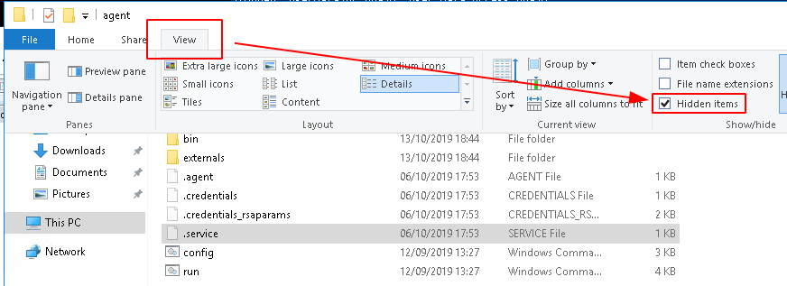
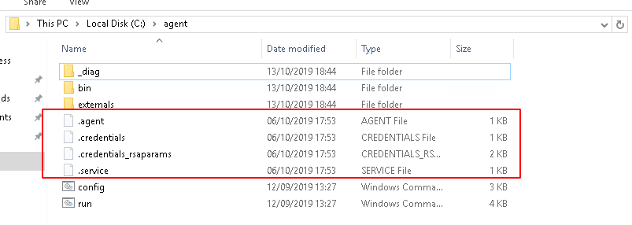
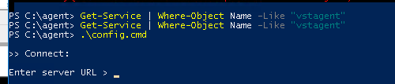
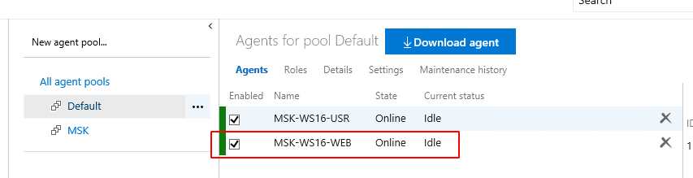

Recently while setting up an On-premises Azure DevOps server I came across a few issues installing and configuring a VSTS Azure Pipelines Agent. During the configuration phase an error reported that the agent was already configured.

I'd been troubleshooting the previous agent install which was reporting as offline even though it was installed and eventually decided to manually uninstall the agent (that issue was certificate based, but that's another story!).

After a little investigation it turned out the error message was due to hidden configuration files which where not removed during the previous manual uninstall.

To view these files, browse to the folder the agent was installed in, in Explorer choose **View** and ensure "**Hidden items**" is ticked, as shown below.

Remove all of the . files

The simply rerun config.cmd and complete the configuration as normal.

One complete the service should be up and running

And the agent online and enabled.

